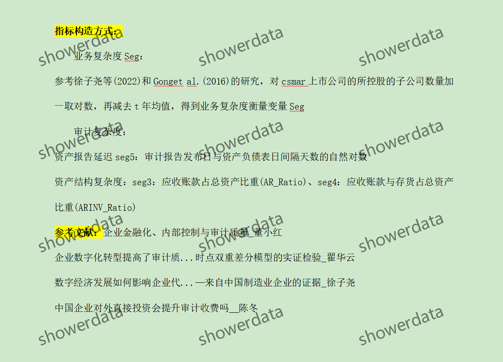
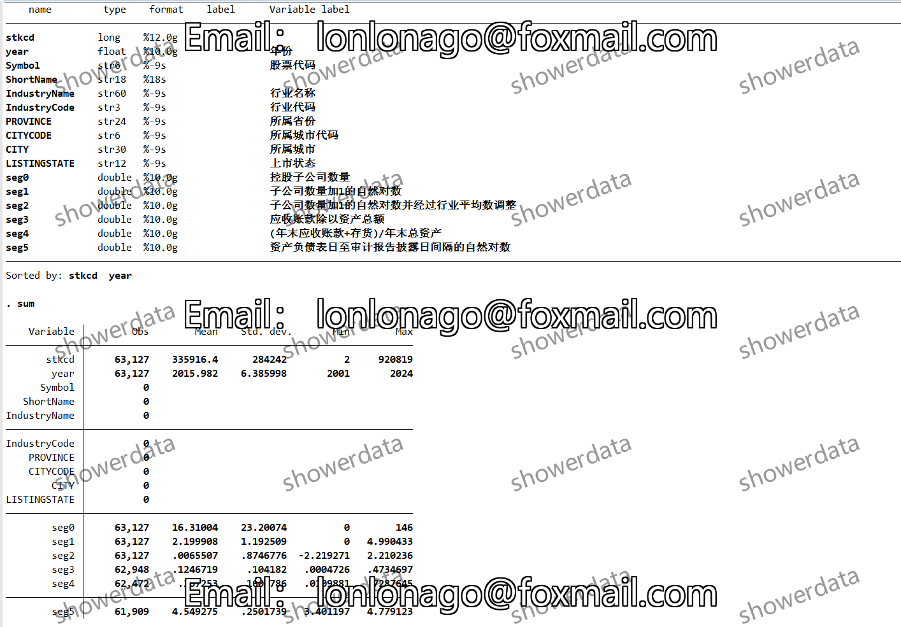
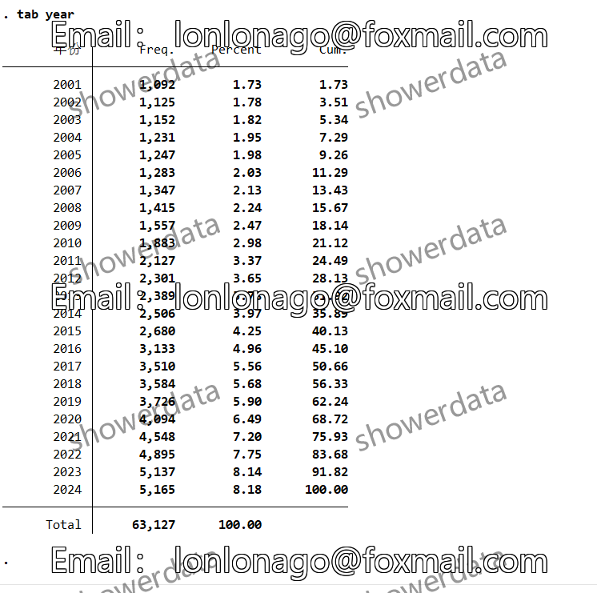
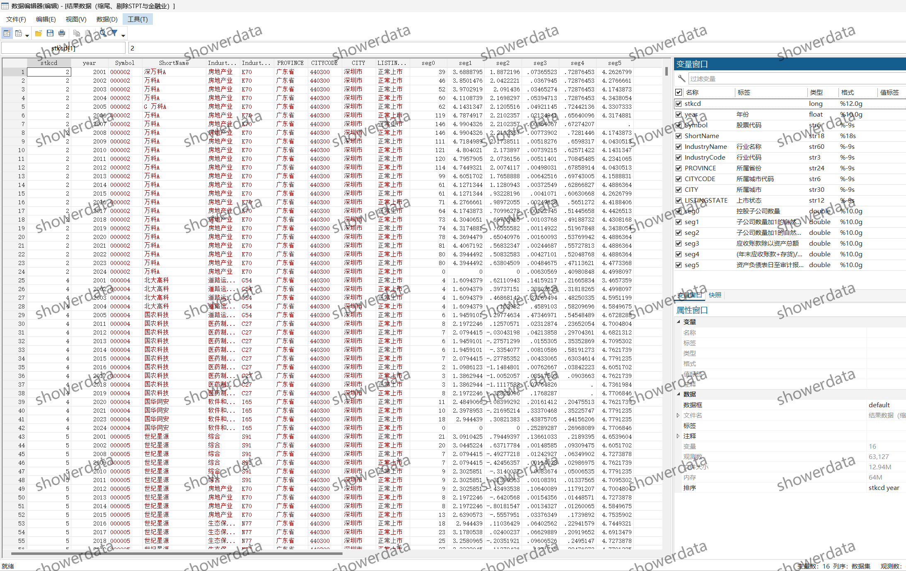
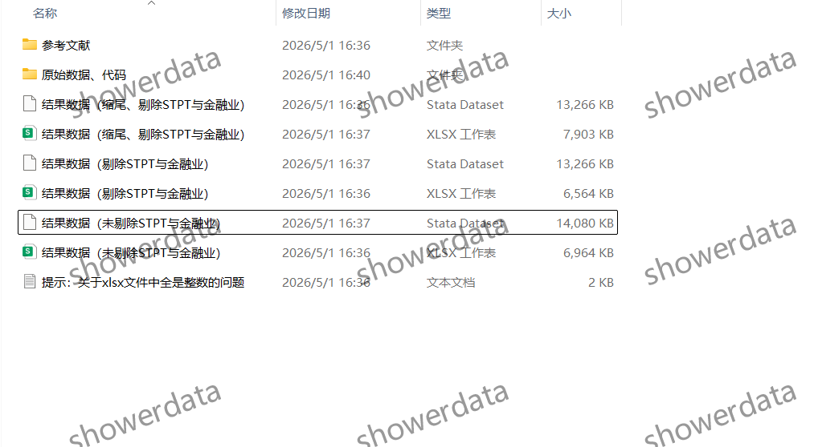

## Body

上市公司业务复杂度（2001-2024）

ps. 业务复杂度原始数据更新至2023，只到2023，审计复杂度到24年，介意勿拍！详情已展示清楚，请看好是否需要！

一、数据介绍
数据名称：上市公司业务复杂度（2001-2024）
样本范围：A鼓尚视公司, 6.3w+观测值（已剔除已缩尾样本量，有未剔除未缩尾版本）
时间范围：2005-2024年
数据格式：excel、dta
数据内容：结果、参考文献、代码、原始数据

二、数据结果指标如图所示

三、计算方法如图所示

四、参考文献如图所示

## Images

Here is a pay link on Stripe ( https://buy.stripe.com/3cs8yP7sY87d0vu9AB ). Please contact me lonlonago@foxmail.com after funding $89, and I will send you a complete data files , thank you!

